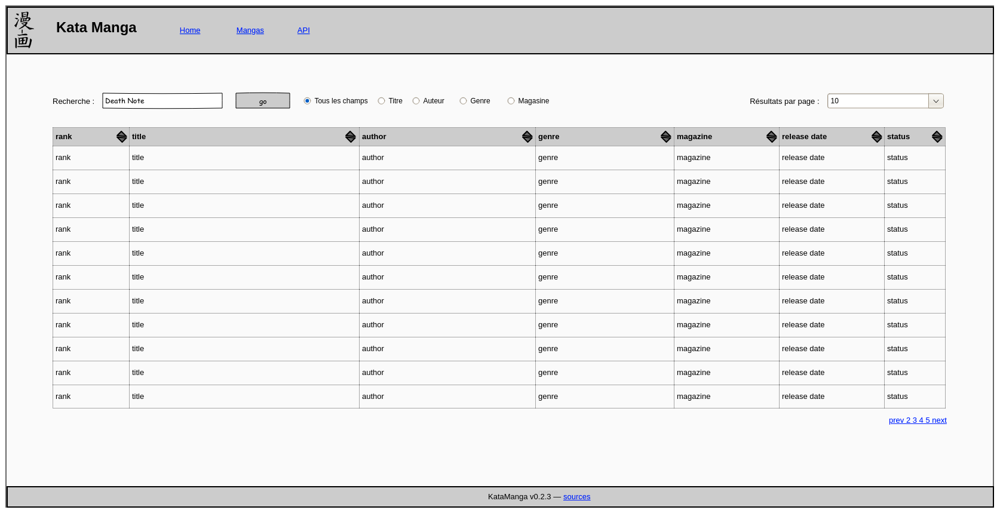
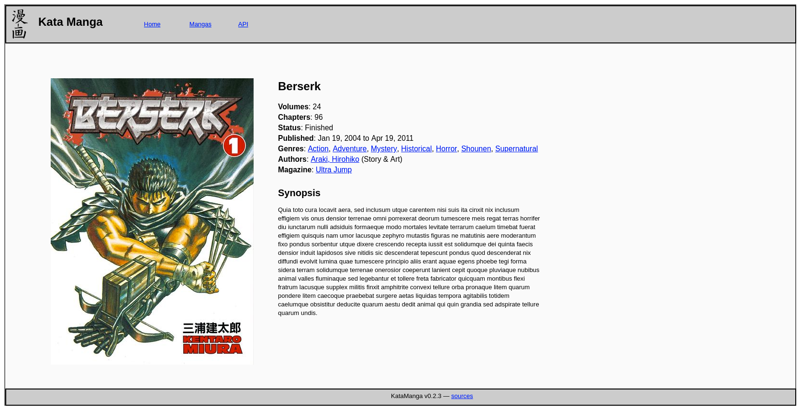
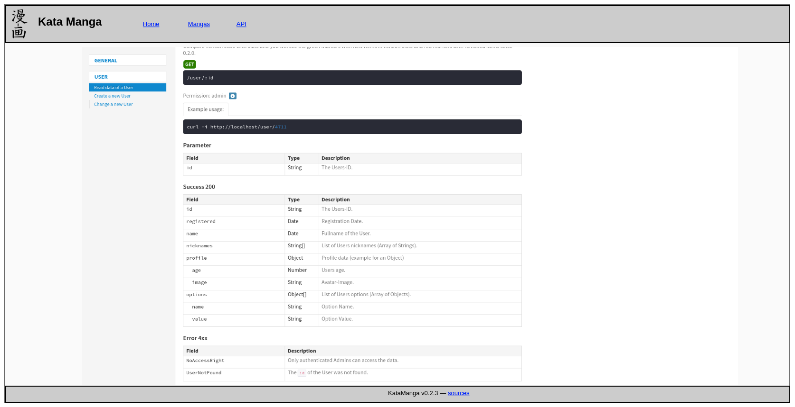

# Kata Manga

<!-- TOC titleSize:2 tabSpaces:2 depthFrom:1 depthTo:6 withLinks:1 updateOnSave:1 orderedList:0 skip:1 title:1 charForUnorderedList:- -->
## Table of Contents
- [À propos](#à-propos)
  - [Vue d'ensemble](#vue-densemble)
- [Informations générales](#informations-générales)
- [Matériel et logiciel à disposition](#matériel-et-logiciel-à-disposition)
- [Prérequis](#prérequis)
- [Descriptif du projet](#descriptif-du-projet)
  - [Conseils sur le déroulé](#conseils-sur-le-déroulé)
  - [API](#api)
  - [Front-end](#front-end)
    - [Home](#home)
    - [Mangas](#mangas)
    - [Manga details](#manga-details)
    - [API](#api)
  - [Tests](#tests)
- [Livrables](#livrables)
  - [Planification](#planification)
  - [Rapport](#rapport)
  - [Journal de travail](#journal-de-travail)
    - [Annexes](#annexes)
  - [Application et code](#application-et-code)
- [Points techniques évalués spécifiques au projet](#points-techniques-évalués-spécifiques-au-projet)
<!-- /TOC -->

## À propos

Le Kata Manga est un exercice de programmation destiné aux apprentis
[informaticiens CFC en voie développement d'applications]. Il est fait
pour se dérouler sous forme de [Travail pratique individuel (TPI)],
dont le cadre est fixé par l'aricle 20 de l'[Ordonnance du SEFRI sur
la formation professionnelle initiale] et l'évaluation faite selon les
[critères d'évaluation ICT], détaillés dans le [document fourni par
iCQ-VD](http://www.tpivd.ch/files/cfc-ordo2k14/2.%20Criteres%20d%20evaluation%20TPI.PDF).

Les sources de ce document se trouvent sur
<https://github.com/ponsfrilus/kata-manga>. Contributions, remarques et
commentaires bienvenues via <https://github.com/ponsfrilus/kata-manga/issues>.

### Vue d'ensemble

Le but de ce travail est de fournir une application Web et une [API] présentant
les 100 [mangas] les plus populaires.

Les données sont fournies sous forme de fichier SQL 
([KataManga_structure_and_data.sql]), que l'apprenti devra exploiter. En cas de 
nécessité, ces données peuvent être regénérées à partir des scripts présents 
dans le dossier [import](https://github.com/ponsfrilus/kata-manga/tree/master/import) 
de ce répertoire et extraient les informations des 100 mangas les plus 
populaires du site [My Anime List](https://myanimelist.net/topmanga.php).

## Informations générales

Le Kata Manga est prévu pour être réalisé en **80 heures**.

La répartition du temps suggérée est la suivante :

  - Analyse : **10%**
  - Implémentation : **50%**
  - Tests : **10%**
  - Documentations : **30%**

## Matériel et logiciel à disposition

La réalisation de ce travail nécessite uniquement un laptop et un accès à
Internet. L'utilisation de logiciels libres est fortement recommandée.

Sont nommément décrits dans le présent cahier des charges, et sont donc réputés
obligatoires, les élements suivants :

  - [docker] et [docker-compose]
  - [Swagger]
  - [MySQL]
  - [Git]

## Prérequis

Pour mener à bien ce travail, l'apprenti doit :

  - connaître les bases de l’administration système ([shell], [ssh], [CLI]), 
  - être à l'aise avec au moins un langage de programmation permettant de
    réaliser un site Web, 
  - savoir manipuler des conteneurs [Docker] et les orchestrer avec 
    [docker-compose], 
  - maîtriser un [système de gestion de base de données (SGBD)] basé sur [SQL],
  - connaître les bases du langage de balisage [MarkDown] pour réaliser les
    documentations presecrites, 
  - être confortable avec l'utilisation de [Git].

## Descriptif du projet

Le but de ce projet est de développer, dans des conteneurs Docker,
l'application Kata Manga. Elle se compose de trois briques fonctionnelles :

  - l'API (aka back-end) ;
  - le site Web (aka front-end) ;
  - la base de données.

_Note que dans certains cas, il se peut que l'API et le front-end se trouvent 
dans le même conteneur._

### Conseils sur le déroulé

Le candidat atteindra, de préférence dans l'ordre, les étapes suivantes :

  - Fondation «ops» : le docker-compose est rédigé; il lance automatiquement la
    base de données et un serveur applicatif pour le langage de programmation
    choisi.

  - Dépendances : les fichiers d'initialisation du système de paquetages choisi
    pour le langage de programmation (ex : Composer, npm ou Yarn) sont en place,
    et une dépendance en logiciel libre a été rajoutée au projet et mise en
    œuvre sur la page d'accueil, qui fonctionne (exemples : Express, Monolog).

  - Reproductibilité : les commandes nécessaires pour cloner et exécuter le
    projet sur une autre machine que celle du développeur ont été documentées et
    testées.

  - Fondation «swagger» : Swagger est installé grâce au système de dépendances
    pré-cité, et une page Web initiale de Swagger est visible.

  - *stubs* Swagger : les différentes entités du modèle relationnel (relations
    exclues) ont été identifiées, et chacune d'elles est visible sous la forme
    d'un modèle sur la page Swagger.

  - Testabilité API : le candidat a établi une stratégie pour tester l'API, et
    en a rendu compte dans les différentes documentations à produire pour au
    moins un verbe HTTP sur au moins une des entités.

  - Lecture complète Swagger : il est possible d'énumérer toutes les entités et
    leurs relations à partir de requêtes GET. Les tests correspondants sont 
    rédigés et validés.

  - Lecture/écriture Swagger : il est possible de créer, modifier et supprimer
    toutes les entités et leurs relations à l'aide de requêtes REST utilisant un
    verbe adapté. Les tests correspondants sont rédigés et validés.

  - Mock-up de front-end : les attentes documentées dans le présent document en
    matière de pages visibles par l'utilisateur du front-end, sont satisfaites
    avec des données «bidon» (qui ne sont pas consultées en base)

  - Testabilité front-end : un cahier de tests est commencé pour valider le
    bon fonctionnement du front-end. Il décrit les actions entreprises par le
    candidat pour effectuer les tests lui-même.

  - Front-end fonctionnel (en lecture seule) : on peut rechercher et consulter,
    comme documenté dans le présent document, toutes les entités et toutes les
    relations des données sous-jacentes via l'interface Web (donc sans passer
    par Swagger). Le cahier de tests est mis à jour.

  - Peaufinage : les autres exigences techniques mentionnées dans ce cahier des
    charges sont atteintes. Le cahier de tests est mis à jour.

**Le rapport, le journal de travail et le dépôt Git doivent être mis à jour en
continu** pour rendre compte des accomplissements à chaque étape ci-dessus.
Aucune «hypothèque» de temps de travail péjorant la documentation ni le code,
ne seront tolérées.

### API

La partie API fournit, sous forme d'API REST, les accesseurs nécessaires pour
créer, lire, mettre à jour et supprimer ([CRUD]) les entités présentes dans
chaque table de la base de données.

La sécurité des données de l'API (vis-à-vis des lectures et écritures non
autorisées, ou bien des attaques XSRF) est en-dehors du périmètre du kata.

### Front-end

Le site Web présente quatre pages aux utilisateurs. L'en-tête fournit un menu de
navigation vers ces dernières. Le pied de page mentionne le numéro de version de
l'application ainsi qu'un lien vers ses sources.

#### Home

Cette page doit accueillir les visiteurs et présenter le projet.

#### Mangas

Page principale du site présentant une liste des mangas.

  - Une table les présentent avec leurs `rank`, `title`, `author`, `genre`, 
    `magazine`, `release date`, `status` ;
  - La ligne contient un lien vers 
    [https://myanimelist.net/manga/{id}](https://myanimelist.net/manga/2) ;
  - Chaque colonne est triable ;
  - Une recherche est possible soit simultanément sur tous les champs de la 
    table, soit séparément sur les champs `title`, `author`, `genre` 
    ou `magazine` ;
  - Le nombre de résultats présentés dans la table peut être modifié (`10`,
    `15`, `20` ou `25`) ;
  - Une pagination est présente, permettant aux visiteurs d'afficher les 
    résultats suivant ou précédant ceux actuellement affichés.

#### Manga details

Page de détails d'un manga.

Cette page présente toutes les informations disponibles en base pour un manga.

L'information des `author`, `genre` ou `magazine` présente un lien vers la page
Mangas avec le filtre de recherche pré-rempli.

#### API

Cette page consiste en la mini-application de découverte de l'API fournie par
Swagger.

Le candidat veille à ce que

  - cette page soit active aussi vite que possible dans le déroulé du projet
  - tous les modèles de la base de données sous-jacente (mangas, genres,
    magazines et auteurs) soient visibles aussi vite que possible dans le
    déroulé du projet (même si initialement toutes les informations ne sont pas
    fournies, ou bien ne sont pas modifiables via l'API)

### Tests

Les scénarios de tests mis en place par le candidat doivent être communiqués
aux intéressés et documentés dans le rapport. Concernant l'API, ces
derniers doivent pouvoir être (re)joués facilement, selon la méthode
et les explications fournies par l'apprenti. Une façon d'automatiser
ces tests (ex : scripts en shell appelant `curl`, ou bien l'outil
[postman](https://www.postman.com/use-cases/api-testing-automation/)) est
vivement recommandée.

## Livrables

### Planification

En fin de première journée de travail, le candidat envoie (au format [PDF]) aux
intéressés une planification initiale détaillant les tâches à accomplir durant
le projet. Le niveau de granularité du découpage doit être de 2 à 4 heures.

Tout au long du projet, le candidat mettra à jour la planification rééle.

En fin de projet, le candidat veillera a ajouter les planifications initiale et
rééle dans son rapport, et prendra le soin de commenter les différences.

### Rapport

Un [canevas de dossier de
projet](http://www.tpivd.ch/files/cfc-ordo2k14/Annexe%203%20Canevas%20Dossier%20de%20projet.docx)
est à disposition du candidat.

Le rapport prête une attention particulière à
détailler les [points techniques évalués spécifiques au
projet](#points-techniques-évalués-spécifiques-au-projet), prouvant que
l'élément a été traité de manière professionnelle par le candidat.

Les termes techniques et les acronymes utilisés dans le rapport sont référencés
dans un glossaire figurant dans le rapport.

Les choix technologiques sont justifiés dans le rapport. Les outils et les
technologies utilisées sont l'objet de descriptions explicatives dans le rapport.

Le document doit évoluer chaque jour. Il sera envoyé dans l'état aux intéressés
deux fois par semaine, au format [PDF].

### Journal de travail

Le journal de travail doit permettre de retracer les activités du candidat
tout au long du déroulement du projet. Durée des tâches, PV des discussions,
problèmes rencontrés, choix, solutions, liens vers la documentation, les
références, sources d'informations, aide extérieur, heures supplémentaires, etc.
doivent être consignés dans ce document (c.f. [critères d'évaluation] **B2**).

Le document doit évoluer chaque jour. Il sera envoyé dans l'état aux intéressés
deux fois par semaine, au format [PDF].

#### Annexes

Le rapport contient tous les documents nécessaires à la compréhension du
déroulement du projet en annexes. Cahier des charges, planifications, journal
de travail, résumé du rapport TPI, etc. doivent être annexés au document.

### Application et code

Le candidat communique l'adresse de son dépôt Git aux intéressés et le maintient
à jour quotidiennement (plusieurs *commits* par jour). Le dépôt est agrémenté
d'un fichier `README.md` au format [MarkDown], qui explique l'utilisation du
projet et sa mise en œuvre. (Voir aussi l'objectif «simplicité des instructions
de mise en œuvre», ci-dessous).

## Points techniques évalués spécifiques au projet

La grille d'évaluation définit les critères généraux selon lesquels le travail
du candidat sera évalué (documentation, journal de travail, respect des normes,
qualité, …).

En plus de cela, le travail sera évalué sur les 7 points spécifiques suivants
(correspondant aux [critères d'évaluation] **A14** à **A20**) :

  1. La qualité du repository [Git] : messages de commits explicites et
     lisibles, permettant de retracer l'évolution du code (plusieurs commits par
     jour, création de branches de fonctionnalités), fichier `README.md` 
     présentant le projet et son déploiement.

  1. Un code exempt de sections copiées/modifiées (principe [DRY : Don’t Repeat
     Yourself]) et respectant le [style de programmation] des langages utilisés.

  1. La simplicité des instructions de mise en œuvre, qui permettent aux
     intéressés d'essayer le projet sur leur propre équipement au fur et à 
     mesure de sa progression.  
     Idéalement, les instructions se limitent à deux étapes 
     (`git clone` et `docker-compose up`).

  1. Les différentes [méthodes HTTP] sont implémentées à bon escient en
     fonction de l'action réalisée sur la ressource indiquée. Les [codes de 
     réponse HTTP] utilisés permettent aux clients d'avoir une information sur 
     le resultat de leurs requêtes.

  1. Le front-end est soigné, la liste des mangas paginée, triable et la
     possibilité de faire une recherche dans la table est présente.

  1. Le rapport démontre que le candidat a étudié le modèle des données : un
     diagramme entité-association ([ERD]) est présent dans le rapport. Le 
     candidat décrit et critique le diagramme et les différentes tables.

  1. L'utilisateur a accès à une page de documentation de l'API,
     qui explique les types de données, les valeurs de retour, les
     différentes possibilités d'interactions avec l'API. Le respect de
     [OAS](http://spec.openapis.org/oas/v3.0.3) et l'utilisation des fonctions 
     de documentation de [Swagger] sont nécessaires pour obtenir le score 
     maximal sur ce point.

[REFERENCES]: ------------------------------------------------------------------
[API]: https://fr.wikipedia.org/wiki/Interface_de_programmation
[CLI]: https://fr.wikipedia.org/wiki/Interface_en_ligne_de_commande
[codes de réponse HTTP]: https://developer.mozilla.org/fr/docs/Web/HTTP/Status
[critères d'évaluation ICT]: https://www.ict-berufsbildung.ch/fileadmin/user_upload/02_Francais/01_formation_initiale/PDF/Beurteilungskriterien_IPA_V1.1_FR.pdf
[critères d'évaluation]: http://www.tpivd.ch/files/cfc-ordo2k14/2.%20Criteres%20d%20evaluation%20TPI.PDF
[CRUD]: https://en.wikipedia.org/wiki/Create,_read,_update_and_delete
[docker-compose]: https://docs.docker.com/compose/
[Docker]: https://www.docker.com/
[DRY : Don’t Repeat Yourself]: https://en.wikipedia.org/wiki/Don%27t_repeat_yourself
[ERD]: https://fr.wikipedia.org/wiki/Mod%C3%A8le_entit%C3%A9-association
[Git]: https://git-scm.com/
[informaticiens CFC en voie développement d'applications]: https://www.ict-berufsbildung.ch/fr/formation-professionnelle/informaticien-ne-cfc-developpement-dapplications/
[KataManga_structure_and_data.sql]: https://github.com/ponsfrilus/kata-manga/tree/master/import/data/KataManga_structure_and_data.sql
[mangas]: https://fr.wikipedia.org/wiki/Manga
[MarkDown]: https://daringfireball.net/projects/markdown/
[méthodes HTTP]: https://developer.mozilla.org/fr/docs/Web/HTTP/M%C3%A9thode
[MySQL]: https://www.mysql.com/
[Open Web Application Security Project® (OWASP)]: https://owasp.org/
[Ordonnance du SEFRI sur la formation professionnelle initiale]: https://www.ict-berufsbildung.ch/fileadmin/user_upload/02_Francais/01_formation_initiale/PDF/Bildungsverordnung_Informatiker_in_EFZ-100f-20131017TRR.pdf
[PDF]: https://en.wikipedia.org/wiki/PDF
[shell]: https://fr.wikipedia.org/wiki/Shell_Unix
[SQL]: https://fr.wikipedia.org/wiki/Structured_Query_Language
[ssh]: https://fr.wikipedia.org/wiki/Secure_Shell
[style de programmation]: https://fr.wikipedia.org/wiki/Style_de_programmation
[Swagger]: https://swagger.io/
[système de gestion de base de données (SGBD)]: https://fr.wikipedia.org/wiki/Syst%C3%A8me_de_gestion_de_base_de_donn%C3%A9es
[Travail pratique individuel (TPI)]: https://www.iffp.swiss/tpi-travail-pratique-individuel

[#]: pandoc README.md \
    --pdf-engine=xelatex \
    -V mainfont="DejaVu Sans" \
    -V urlcolor=cyan \
    -V papersize:a4paper \
    -V monofont="FreeMono" \
    -V geometry:vmargin=2cm \
    -V geometry:hmargin=3cm \
    -V block-headings \
    -o README.pdf; \
  xdg-open README.pdf